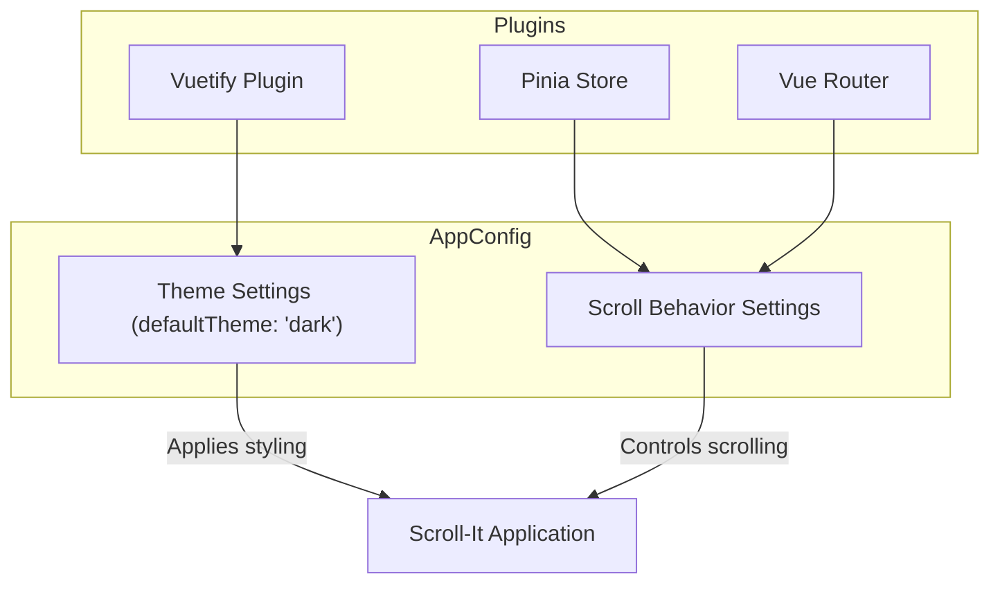

# Configuration Overview

Understand how to tailor Scroll-It to your personal preferences by exploring the available configuration settings, including theme customization and scroll behavior adjustments. This guide highlights where you can find user-editable settings and explains the role of core plugins that enable these configurations.

---

## 1. Overview of Configuration Settings

Scroll-It offers a clear set of configuration options that empower you to personalize your experience. These settings focus on two primary areas:

- **Theme Customization:** Choose between light and dark modes or customize the appearance to reduce eye strain.
- **Scroll Behavior:** Adjust parameters controlling how Scroll-It scrolls through Reddit threads for your optimal browsing.

All configurations are integrated seamlessly with Scroll-It’s core plugins, providing smooth and responsive adjustments.

---

## 2. Where to Find and Edit Settings

### User-Editable Locations

Most user configuration settings are accessible within the application's settings panel once launched. For developers or advanced users, some configurations exist in the source files, primarily under the `src/styles/settings.scss` for style overrides and theme adjustments.

Key configuration files include:

- **Theme Settings:**
  - Defined through Vuetify's plugin configuration in `src/plugins/vuetify.ts`.
  - Here, the default theme is set (Scroll-It defaults to a dark theme for comfortable night use).
- **Scroll Behavior Settings:**
  - Managed through component properties or Vuex/Pinia state stores controlling scroll speed and smoothness.

> These settings are abstracted through Vuetify and Vue framework conventions to provide a consistent, responsive interface.

---

## 3. Understanding Core Plugins Enabling Configuration

Scroll-It leverages core plugins to manage theming and behavior smoothly:

- **Vuetify:**
  - A Material Design UI framework controlling global theming and visual styling.
  - Default theme configuration is loaded from `src/plugins/vuetify.ts`, where you can switch themes if desired.

- **Pinia:**
  - Manages the application state including user preferences related to scrolling.

- **Vue Router:**
  - Handles navigation state that can interact with configuration persistence.

#### How These Plugins Connect to Configuration



This integration ensures that the UI updates reactively whenever configuration changes occur.

---

## 4. Customizing Theme Settings

### Changing the Default Theme

Scroll-It uses Vuetify, allowing you to easily switch from the default dark theme:

1. Open `src/plugins/vuetify.ts` in your development environment.
2. Locate the `theme` configuration block.
3. Change `defaultTheme` from `'dark'` to `'light'` or any other supported Vuetify theme you have defined.

```typescript
// Example: Changing from dark to light theme
export default createVuetify({
  ssr: true,
  theme: {
    defaultTheme: 'light',
  },
})
```

4. Save the file and restart the application to see the change.

### Best Practices

- Prefer dark mode for long browsing sessions to reduce eye fatigue.
- Customize colors further by modifying Vuetify’s SASS variables in `src/styles/settings.scss` if you need brand-specific palettes or accessibility tweaks.

---

## 5. Adjusting Scroll Behavior

Scroll-It’s core value comes from smooth and customizable Reddit thread scrolling.

### How to Configure Scroll Behavior

Currently, scroll behavior settings include parameters such as scroll speed and smoothness, typically exposed via the user interface or set within state management (Pinia store).

To adjust:

1. Locate the scroll control settings in the app interface (often within settings or preferences).
2. Adjust sliders or input fields for scroll speed (e.g., from slow to fast).
3. For developers, review and modify scroll parameters within the store files or related components inside `src/stores` or relevant Vue components.

### Practical Example

If you want the scroll speed to double, increase the speed value accordingly in the UI or directly via the state.

---

## 6. Troubleshooting Configuration Issues

<Tip>
If changes to theme or scroll behavior don’t take effect, try the following:
- Clear your browser cache and reload the app.
- Restart the development server if working from source.
- Check browser console for warnings related to Vuetify or plugin initialization.
</Tip>

<Warning>
Direct modification of core plugin files should be done cautiously. Always back up your configuration and use version control to track changes.
</Warning>

---

## 7. Next Steps

After understanding this configuration overview, proceed to:

- **First Run & Quick Validation:** Ensure your configuration changes are active and functioning as expected. This guide details how to verify your setup.
- **Customizing Scrolling Speed and Behavior:** Explore advanced settings to fine-tune your Scroll-It experience.

You can also refer to Vuetify’s official [Documentation](https://vuetifyjs.com/en/introduction/why-vuetify/) to deepen your understanding of theming.

---

## References

- [`src/plugins/vuetify.ts`](https://github.com/modelorona/Scroll-It/blob/main/app_vue3/src/plugins/vuetify.ts) — Theme Configuration
- [Vuetify Framework Documentation](https://vuetifyjs.com/en/)
- [`src/styles/settings.scss`] Custom style overrides
- Scroll behavior settings within application stores (Pinia plugins)

---