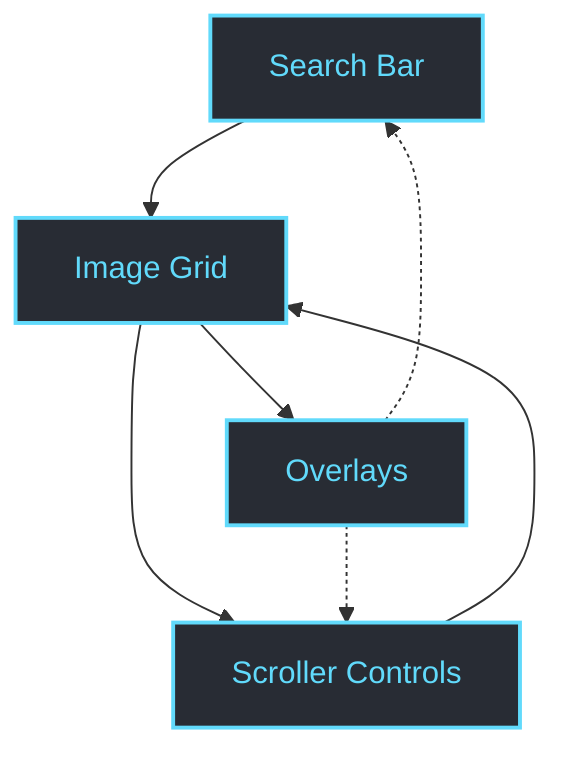

# Understanding the Core Interface

A quick, focused guide designed to help you get comfortable with the main components of the Scroll-It user interface: the search bar, image grid, scroller controls, and overlays. This guide empowers you to identify each element and interact with them smoothly for optimal browsing and scrolling performance.

---

## 1. Getting Oriented

Before you dive in, it’s important to understand what you see on the screen. The core interface is carefully structured to enhance your experience while browsing Reddit threads using Scroll-It.

### Key Interface Components:

- **Search Bar:** Your gateway to exploring Reddit content seamlessly.
- **Image Grid:** Displays fetched Reddit posts visually through images.
- **Scroller Controls:** Manage the automatic scrolling behavior for a hands-free reading experience.
- **Overlays:** Informational and control layers that provide additional context or action options.

### What You Will Achieve:

- Identify each UI element at a glance.
- Learn how to interact efficiently with controls to customize your browsing.
- Understand how overlays support your journey without disrupting flow.

---

## 2. Using the Interface: Step-by-Step

<Steps>
<Step title="Locate and Use the Search Bar">
Start by finding the search bar at the top of the interface.

- Click inside the search input to activate it.
- Type your desired subreddit or keywords.
- Press `Enter` or click the search icon to fetch related Reddit posts.

**Expected Result:** The image grid below updates with posts matching your query.
</Step>

<Step title="Interact with the Image Grid">
Once content loads, you’ll see images representing Reddit posts arranged in a grid.

- Scroll through the images to preview posts visually.
- Click on any image to expand details or open the post in Reddit.

**Expected Result:** The selected post opens in an overlay or new tab depending on settings.
</Step>

<Step title="Adjust Scroller Controls">
Scroller controls typically sit near the bottom or side of the interface.

- Use the play/pause button to start or stop automatic scrolling.
- Adjust scrolling speed via sliders or predefined speed buttons.
- Toggle scrolling direction if supported (vertical/horizontal).

**Expected Result:** Your scroll behavior updates instantly, offering a tailored reading pace.
</Step>

<Step title="Use Overlays for Extra Info and Actions">
Overlays are context-sensitive layers that appear over the main view.

- Look for overlays that provide post metadata, NSFW warnings, or content filters.
- Interact with buttons in overlays to hide, report, or save content.
- Dismiss overlays by clicking outside or pressing close icons.

**Expected Result:** Overlays provide needed detail or control options without interrupting flow.
</Step>
</Steps>

<Note>
If any of these components do not appear as described, ensure your Scroll-It app is fully loaded and connected to Reddit. Refer to the 'First Run & Quick Validation' guide for troubleshooting.
</Note>

---

## 3. Practical Tips & Best Practices

- **Search Bar Tips:** Use precise subreddit names for faster and more relevant loading.
- **Image Grid Navigation:** Use keyboard arrow keys (if supported) to quickly browse posts.
- **Scroller Controls:** Start with moderate speeds; increase once you’re comfortable.
- **Overlay Management:** Take advantage of overlays to filter out NSFW content or irrelevant posts efficiently.

---

## 4. Troubleshooting Common Interface Issues

### Problem: Search bar not responding or no results appear
- Confirm your internet connection is stable.
- Double-check the subreddit name or keywords spelling.
- Refresh the app or restart it if persistent.

### Problem: Images in the grid fail to load
- Clear your browser cache associated with Scroll-It.
- Check Reddit’s accessibility status (some posts may be removed or restricted).

### Problem: Scroller controls don’t start or pause properly
- Verify you are not in a maintenance mode.
- Restart the app to refresh service connections.

<Warning>
Continued failure to use core interface elements may indicate network or permission issues. Consult the System Architecture and Installation guides for deeper diagnosis.
</Warning>

---

## 5. Next Steps & Related Content

- After mastering the core interface, explore **Customizing Scrolling Speed and Behavior** to tailor your experience precisely.
- Learn how to handle sensitive content effectively in the **Handling NSFW Content** guide.
- For mobile users, check **Mobile Browsing Best Practices** to optimize Scroll-It on handheld devices.

---

## Visual Overview (Diagram)

This diagram shows the flow and relationships between main interface components to reinforce your understanding.

---

For deeper details and technical context about the app structure and setup, consider reviewing the linked documentation sections in your navigation pane.

