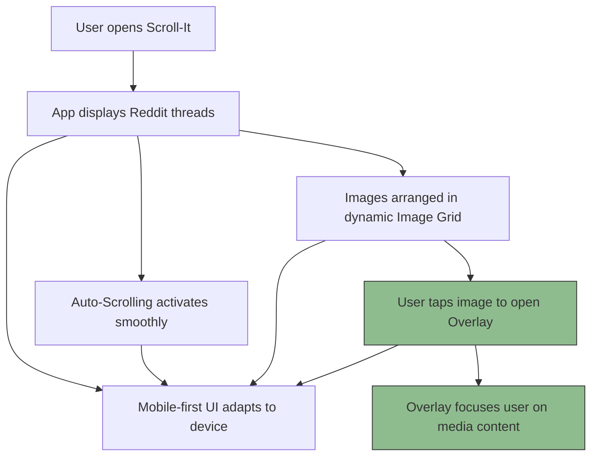

# Core Concepts & Terminology

Welcome to the foundational guide that clarifies the essential concepts and terminology powering Scroll-It’s user experience. Understanding these key ideas will help you navigate the interface confidently and make the most of the application’s seamless browsing capabilities.

---

## What Are Core Concepts in Scroll-It?

Scroll-It is designed around several central ideas that shape how users interact with Reddit threads. These concepts are tightly linked to the UI elements you encounter and the behaviors that improve usability. By grasping these, you will better understand the app's unique scrolling and viewing methodology.

### Auto-Scrolling

**Definition:** Auto-scrolling is the automatic vertical movement through content without requiring manual user input such as dragging or swiping.

**Why It Matters:** Instead of clicking or tapping repeatedly to move through posts, Scroll-It lets you enjoy a continuous, hands-free flow of Reddit threads. This dramatically improves reading comfort, especially for long browsing sessions.

**How It Works in the UI:**
- Once activated, the app scrolls the feed at a consistent speed.
- Users can adjust the scrolling speed and pause or resume scrolling.

**Example Scenario:** Imagine reading a long comment thread on your phone. Auto-scrolling glides through the comments gently, so you can sit back and savor discussions without fussing over taps.

---

### Image Grid

**Definition:** The image grid is a layout style that displays multiple images in an organized, tiled arrangement.

**User Benefit:** The grid provides a clear overview of media content, allowing users to quickly scan multiple images at once without excessive scrolling.

**Relation to User Interaction:**
- Users can tap images to enlarge them or open overlays for detailed viewing.
- The grid adapts dynamically for different screen sizes, maintaining visual clarity.

**Real-World Example:** When scrolling through a subreddit heavy on images, like r/pics, the app arranges all images in grid format so you see more content simultaneously, making discovery faster and more engaging.

---

### Overlay

**Definition:** An overlay is a UI element that appears on top of the current content to provide an enlarged or focused view, often dimming the background.

**Purpose:** Overlays enable users to concentrate on select content items like images or videos without distractions.

**How You Use It:**
- Tap an image in the grid to open it in an overlay.
- The overlay supports navigation (e.g., swipe left/right) to browse adjacent media.
- Exit the overlay by tapping outside or using the close button.

**User Experience Impact:** This direct interaction offers an immersive way to examine details without losing context of where you are in the feed.

---

### Mobile-First Design

**Definition:** Mobile-first design means prioritizing the user experience for small screens (smartphones, tablets) during design and development, ensuring smooth interaction on mobile devices before scaling up to desktops.

**Why Scroll-It Embraces This:** A significant portion of Reddit browsing happens on mobile devices. Scroll-It is optimized to:
- Deliver fast, responsive scrolling.
- Ensure images and overlays render clearly on various screen sizes.
- Maintain easy navigation with touch-friendly controls.

**Effect in Practice:** Whether you use Scroll-It on a phone or tablet, the layout and controls adapt seamlessly to provide an intuitive and enjoyable experience.

---

## How These Concepts Work Together in Scroll-It

Scroll-It blends these core ideas into a cohesive flow:

This flow ensures users experience:
- Constant, hands-free content progression (auto-scroll).
- Convenient access to visual and media-rich elements (image grid).
- Focused and distraction-free viewing (overlay).
- Responsive performance on all devices (mobile-first).

---

## Practical Tips to Get the Most Out of These Concepts

- **Auto-Scrolling:** Adjust your preferred scroll speed in the settings to match your reading pace. Use the pause feature when you want to explore content more closely.
- **Image Grid:** Navigate the grid to get a snapshot overview of media, and tap images to zoom without losing your scroll position.
- **Overlay:** Take advantage of overlay navigation to move through media without returning repeatedly to the main feed.
- **Mobile-First:** Explore Scroll-It on your mobile device for the intended seamless experience; the interface is tailored for your fingertips.

---

## Common Pitfalls and How to Avoid Them

- Trying to manually scroll while auto-scrolling is enabled can cause unexpected jumps — pause auto-scroll before manual interaction.
- On slower networks, image grids might take a moment to load; waiting a few seconds ensures full media display.
- If an overlay does not close, tapping outside the image or pressing the designated close button resolves the issue.

---

By mastering these terms and their practical applications, your journey through Scroll-It becomes effortless and enjoyable. These core ideas form the backbone of the user experience, letting you immerse fully in Reddit content with minimal friction.

For deeper dives into features and architecture, explore the [System Architecture](/overview/architecture-core/system-architecture) and [Quick Feature Overview](/overview/architecture-core/feature-overview) pages.

---

### Ready to start scrolling smarter? Check out our [Getting Started Guide](/getting-started/setup-prerequisites-installation/system-requirements) for setup and tips.