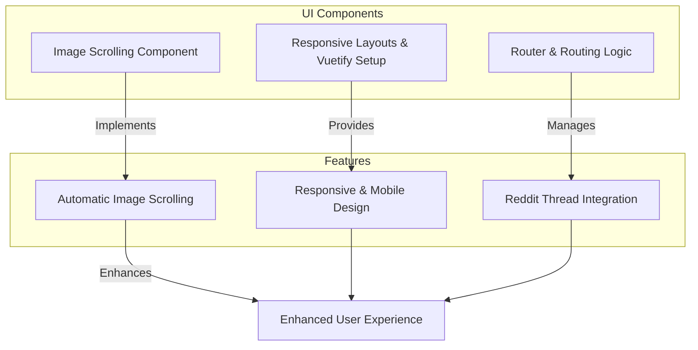

# Quick Feature Overview

## Unlocking Scroll-It's Core Capabilities

Scroll-It is engineered to transform how you interact with Reddit threads and images by seamlessly combining automatic image scrolling, responsive design tailored for all devices, and native Reddit integration. This page presents a clear summary of these principal features, helping you understand where they shine within the app and where to look in the codebase for their implementation.

---

## Automatic Image Scrolling

Imagine effortlessly gliding through a rich gallery of images embedded inside your favorite Reddit threads without manual scrolling. Scroll-It's automatic image scrolling feature removes the interruption of manual navigation by smoothly advancing images for you.

- **What It Does:** Automatically transitions images in a continuous, visually pleasing flow.
- **User Benefit:** Enables a hands-free browsing experience, perfect for catching up on visual content while multitasking.

### How It Works in the App

This feature is integrated within the core viewing components that handle Reddit threads displaying image content. The automatic scrolling logic controls timing, smooth transitions, and looping behavior ensuring the feed stays dynamic.

> **Looking in Code:**
> - Implementation is found in the Vue components responsible for image display.
> - Related logic includes timer management and transition controls.

### Real-World Scenario

Picture yourself viewing a Reddit thread full of high-quality art or photography. Scroll-It handles scrolling through each image at an optimized pace — freeing you from constant interaction yet allowing easy manual override.

---

## Responsive and Mobile-Optimized Design

Scroll-It adapts elegantly to your screen, delivering a consistent and comfortable experience whether on a desktop, tablet, or phone.

- **What It Does:** Dynamically adjusts layouts, font sizes, and controls based on device and screen size.
- **User Benefit:** Ensures smooth usability, readability, and intuitive navigation on any device, fully supporting mobile users who prefer browsing on the go.

### How It's Built

Utilizing modern CSS techniques combined with Vue and Vuetify’s responsive UI components, the app automatically reflows content and optimizes touch interactions. This approach provides an interface that feels native on mobile while retaining desktop power.

> **Looking in Code:**
> - Found predominantly in layout components and Vuetify theming setup.
> - Responsive behavior leverages Vuetify’s grid system and breakpoints.

### Real-World Scenario

Whether lounging with a tablet or scrolling Reddit threads on your smartphone during a commute, Scroll-It’s responsive design guarantees an optimized interface that keeps interaction frictionless and enjoyable.

---

## Seamless Reddit Thread Integration

Connecting you directly to Reddit’s rich discussions, Scroll-It pulls in live Reddit threads, allowing you to browse posts and comments in a streamlined, distraction-free environment.

- **What It Does:** Fetches Reddit thread data including posts, comments, and media.
- **User Benefit:** Access the latest Reddit content without leaving the app, making content consumption and conversation effortless.

### How Integration Functions

The app utilizes automatic routing to Reddit threads and fetches data dynamically. Sorting options and subreddit selections are supported, enhancing the customized browsing experience.

> **Looking in Code:**
> - Routing and data fetching components manage thread integrations.
> - Vue Router handles dynamic route parameters like subreddit names.

### Real-World Scenario

You want to follow a Reddit discussion about a trending topic. Scroll-It lets you load the subreddit thread, scroll through engaging posts and images automatically, and keep up without navigating away or switching apps.

---

## Summary of Principal Features

| Feature                     | User Benefit                               | Code Location                         |
|-----------------------------|--------------------------------------------|-------------------------------------|
| Automatic Image Scrolling    | Hands-free image viewing                    | Vue components handling image display |
| Responsive/Mobile Design     | Consistent UX across devices                | Layout components & Vuetify setup    |
| Reddit Thread Integration    | Direct interaction with live Reddit threads | Router and data-fetching modules     |

---

## Best Practices & Tips

- **Manual Override:** Even with automatic image scrolling, you can pause or manually navigate if you want to linger on a particular image.
- **Mobile Browsing:** Use Scroll-It on your mobile device for the smoothest Reddit image and thread browsing experience on the go.
- **Keep Updated:** Explore the router setup to understand how subreddit and thread routing works—ideal for extending or customizing thread views.

## Troubleshooting Common Issues

- If images do not scroll automatically, verify network conditions or that your browser supports JavaScript timers.
- Responsive layout issues usually resolve by refreshing or clearing cache; ensure you’re running a supported browser version.
- For Reddit integration problems (thread not loading), confirm your internet connection and check for any Reddit API rate limits or bans.

---

## Next Steps

Ready to dive deeper?

- Explore [Launching Scroll-It and Browsing Reddit Threads](/guides/getting-started/launch-and-connect) to experience how to start using the core functionality.
- Visit [Customizing Scrolling Speed and Behavior](/guides/using-advanced-features/customizing-scrolling) if you want to tailor the scrolling pace to your preference.
- Check [Mobile Browsing Best Practices](/guides/using-advanced-features/mobile-optimization) for expert tips on getting the best mobile experience.

---

Scroll-It blends automation, responsive design, and deep Reddit integration for an effortless, immersive browsing experience. This overview points you to where these capabilities live, both in use and in code, empowering you to maximize or extend the app's potential.

---

### Visual Overview of Feature Integration

