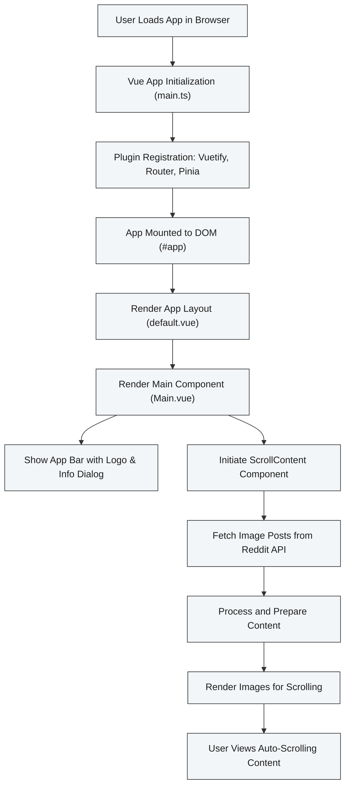

# System Architecture

## Unlocking How Scroll-It Works: A High-Level Overview

Scroll-It brings you a streamlined experience for scrolling through Reddit image posts effortlessly. But how does it deliver this smooth performance? This page breaks down the application's architecture, focusing on key components and the flow of data — all in user-friendly terms, complete with a diagram to visualize the process.

---

## At a Glance: What Makes Up Scroll-It?

Scroll-It is a web application built with modern front-end technologies designed for speed, flexibility, and a highly responsive user interface. The main pillars of the system are:

- **Vue.js 3**: The reactive JavaScript framework responsible for structuring the app, managing UI updates, and delivering a seamless user experience.
- **Vuetify**: A Material Design component library integrated for consistent styling and ready-to-use UI elements that enhance usability and aesthetic coherence.

Together, these components create a robust frontend system that efficiently pulls in Reddit content, processes it, and displays it interactively.

## Why This Architecture Matters

Users want Scroll-It to be fast, intuitive, and reliable. The architecture is designed to:

- Initialize quickly so you can start browsing immediately.
- Handle content retrieval and rendering fluidly to avoid delays.
- Offer a clean, accessible interface that keeps distractions to a minimum.

This setup ensures you get exactly that — a smooth, uninterrupted scrolling experience through Reddit's image posts.

---

## Core Components Explained

### 1. App Initialization

The app boots up through the `main.ts` entry point, which sets the stage:

- It creates a Vue 3 application instance.
- Registers essential plugins such as Vuetify (for UI components), Vue Router (for page navigation), and Pinia (for state management).
- Mounts the app onto the page DOM element with the ID `#app`, launching the user interface.

### 2. UI Layout & Navigation

- `App.vue` wraps the app in Vuetify’s components like `<v-app>` and `<v-main>`, which provide core layout scaffolding.
- The `default.vue` layout adds a footer and renders the current route’s page content dynamically using Vue Router.

### 3. Main Content Component

- The heart of visible interaction, `Main.vue`, includes:
  - A top app bar featuring the site logo and an info dialog explaining the app’s background.
  - The `ScrollContent` component (not detailed here) that performs the crucial task of fetching, processing, and rendering Reddit posts.

### 4. Plugin Ecosystem

- **Vuetify plugin** injects consistent Material Design styling and components across the app.
- **Pinia plugin** powers state management, ensuring data such as user preferences or fetched Reddit content is efficiently handled.
- **Router plugin** enables dynamic, SPA-style navigation without full page reloads.

### 5. Build & Development Tools

- Vite powers the development and build process allowing fast startup and Hot Module Replacement (HMR) for rapid iteration.
- Auto-import plugins automatically bring Vue composables and components into scope without manual imports.

---

## Data Flow: From Initialization to Content Rendering

The system’s main workflow unfolds as follows:

1. **Start-Up**: User loads the app URL.
2. **App Booting**: `main.ts` initializes Vue, registers plugins, and mounts app to DOM.
3. **Layout Rendering**: Using `default.vue` layout, the app shows the header, main content area, and footer.
4. **Content Component Activation**: `Main.vue` renders, initializing the scrollable content region.
5. **Data Fetching & Processing**: Inside `ScrollContent`, the app accesses Reddit’s API (or cached data), retrieves image posts, and prepares them for display.
6. **User Interaction**: Scroll-It automatically or manually scrolls through this content, managing loading states and handling UI updates.

 

---

## Practical Tips & Best Practices

- **Fast loading:** Thanks to Vite and the modular architecture, starting Scroll-It is nearly instant; however, a good internet connection improves Reddit content loading times.
- **Responsive UI:** The Vuetify integration ensures that Scroll-It looks great and works well on desktop and mobile devices.
- **Troubleshooting:** If the content fails to load, check your network connection or Reddit API status. The app's error handling (mainly in `ScrollContent`) will notify you if data fetching encounters issues.

---

## Summary

This page shows how Scroll-It organizes its core technology stack and orchestrates components to provide a frictionless Reddit image browsing experience. By understanding the flow from app initialization through to content display, you gain insight into how modern Vue.js and Vuetify architectures empower this product.

For developers and curious users, this overview reveals the logical layers beneath the simple interface, reinforcing why Scroll-It performs the way it does.

---

## Next Up

To dive deeper into specific concepts or expand your knowledge:
- Explore [Core Concepts & Terminology](../core-concepts-terminology) to understand key terms used throughout the app.
- Review [Feature Overview](../feature-overview) to learn about functional highlights.
- See [Integrations and Dependencies](../integrations-and-dependencies) for details about third-party libraries and their roles.

---

## References

- Vue 3: https://v3.vuejs.org/
- Vuetify: https://vuetifyjs.com/en/
- Vite: https://vitejs.dev/
- Pinia State Management: https://pinia.vuejs.org/
- Vue Router: https://router.vuejs.org/
- Scroll-It GitHub Repository: [https://github.com/modelorona/Scroll-It](https://github.com/modelorona/Scroll-It)

