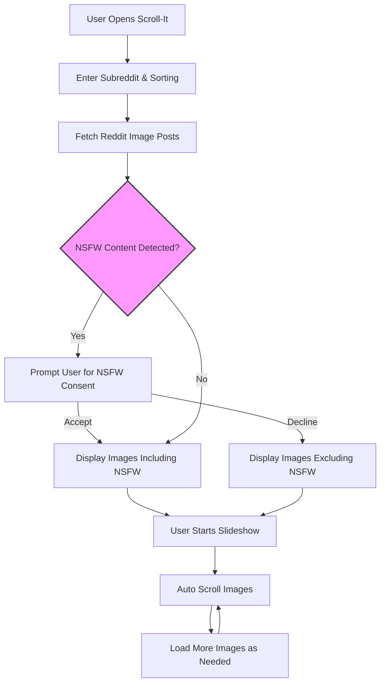

# What is Scroll-It?

## Discover a Hands-Free Way to Enjoy Reddit Image Threads

Scroll-It is a lightweight, mobile-friendly web application designed to automatically scroll through Reddit image threads, transforming endless scrolling into a seamless, hands-free gallery experience. Whether you’re casually browsing Reddit or looking to relax and view images effortlessly, Scroll-It lets you sit back and enjoy curated content at your own pace.

---

## Why Scroll-It Matters

The inspiration behind Scroll-It came during the 2020 Lockdown, when the creator sought to learn Vue.js and Vuetify by building a simple, focused project. Drawing inspiration from existing solutions like [Imagoid](http://www.imagoid.com/), Scroll-It zeroes in on one core functionality — auto scrolling Reddit image posts — with an emphasis on usability and mobile optimization.

This focus results in a clean, intuitive interface that frees you from manual scrolling, making it easy to immerse yourself in the images without interruption.

---

## What Exactly Is Scroll-It?

Scroll-It is a specialized viewer that:

- Automatically scrolls through sequences of images posted on Reddit threads.
- Prioritizes mobile-friendly design to fit your phone or tablet screen.
- Provides a distraction-minimized interface where images take center stage.

The app connects directly to Reddit, fetching images from any subreddit you choose, applying filters to exclude non-image posts and handling age-restricted content thoughtfully.

## Core Purpose

At its heart, Scroll-It solves the common frustration of loading and continuously scrolling through lengthy Reddit image threads manually. Instead, it enables a continuous slideshow-like experience, delivering images in a streamlined, autoplay format.

By doing so, Scroll-It helps you:

- Spend more time enjoying content, less time managing it.
- Easily discover Reddit’s visual posts without search fatigue.
- Maintain focus and relaxation when consuming visual media.

---

## Key Features That Bring Scroll-It to Life

- **Auto Scrolling Slideshow:** Images scroll at a steady, configurable pace, allowing you to watch without touching the screen.
- **Subreddit Selection & Sorting:** Choose your favorite subreddit and sorting options (hot, new, top) to tailor your feed.
- **NSFW Content Handling:** A clear, respectful dialog manages age-sensitive images; you gain control over what you see.
- **Image Overlay & Navigation:** Click any image to view full-screen, navigate with keyboard shortcuts or on-screen controls.
- **Dynamic Loading:** More images load seamlessly as you approach the end of the list, ensuring uninterrupted viewing.

---

## Real-Life User Scenario

Imagine you’re winding down after a long day. You want to view beautiful or interesting images from "r/EarthPorn" without fiddling endlessly with the mouse or your phone screen. With Scroll-It, you enter the subreddit, hit "Start slideshow," and images begin scrolling at a gentle pace. You relax, enjoy the visual flow, and only intervene if you want to pause, jump back, or explore a particular image in depth.

---

## Why Should You Care?

Scroll-It saves you time and effort by removing the distraction of manual scrolling, letting you enjoy Reddit’s rich image content effortlessly. It also ensures a smoother experience on mobile devices, where scrolling fatigue and conversion issues can be common. The app’s clean design ensures that nothing stands between you and the images.

Before Scroll-It, users had to juggle loading delays, accidental taps, and inconsistent behavior on different devices. Scroll-It refines this experience into a single, dependable tool.

---

## Getting Started Snapshot

Ready to jump in? Getting started with Scroll-It is straightforward:

1. Enter your favorite subreddit (e.g., r/EarthPorn).
2. Select how you want posts sorted (hot, new, top).
3. Start the slideshow with one tap, or browse manually.

No login or complicated setup needed. Just open the app on your phone or desktop and begin exploring.

For step-by-step usage, visit [Launching Scroll-It and Browsing Reddit Threads](/guides/getting-started/launch-and-connect) to dive deeper.

---

## Additional Details & Considerations

- **Privacy Focus:** Scroll-It collects no analytics or personal data and does not use cookies, respecting your privacy.
- **Open Source:** The project’s source code is available on [GitHub](https://github.com/modelorona/Scroll-It) for transparency and contributions.
- **Content Ownership:** All images belong to Reddit and their original posters. Scroll-It simply presents this content in an enhanced viewer.

---

Explore, enjoy, and let Scroll-It simplify your Reddit image browsing experience — making it more accessible, relaxing, and fun.

---

For any questions or feedback, feel free to connect with the creator on [LinkedIn](https://www.linkedin.com/in/ahristozov/).

---

## Visual Summary of Scroll-It Workflow

---

## Related Documentation

- [Value Proposition & Use Cases](/overview/introduction-value/value-proposition-use-cases)
- [Target Audience](/overview/introduction-value/target-audience)
- [Launching Scroll-It and Browsing Reddit Threads](/guides/getting-started/launch-and-connect)
- [Customizing Scrolling Speed and Behavior](/guides/using-advanced-features/customizing-scrolling)

---

Stay tuned for more guides on maximizing the Scroll-It experience and mastering your Reddit image viewing habits.